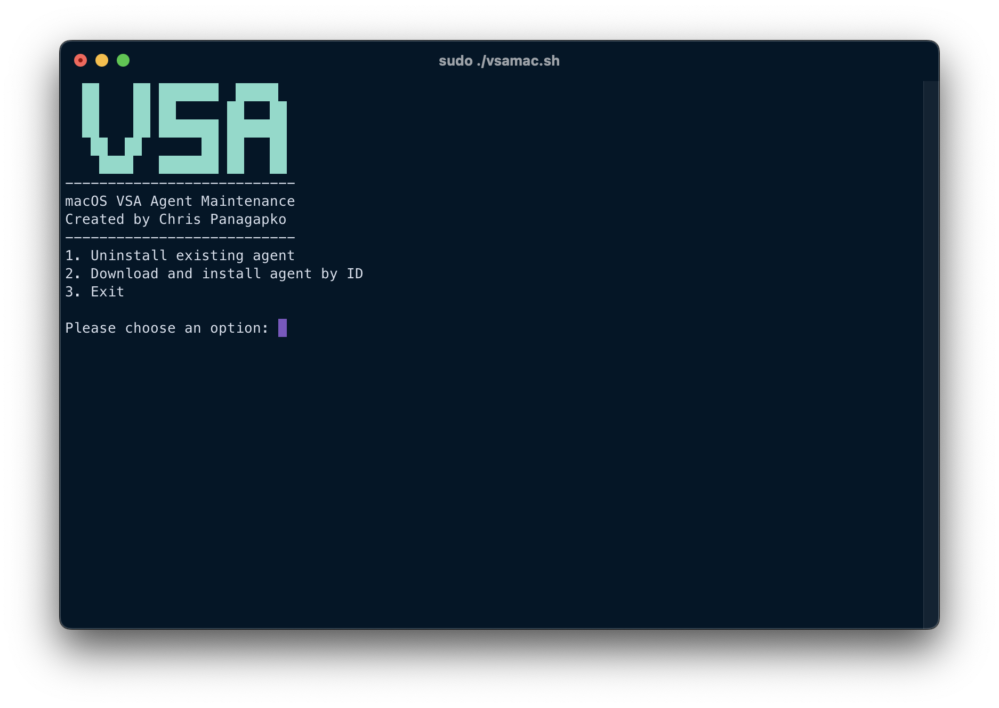

# Kaseya VSA Agent Tool for macOS
## Features
### Agent Uninstall
Cleanly remove the Kaseya VSA agent and all related files/folders on macOS. This is particularly useful after a failed agent install as there will be files left behind that will prevent or hinder another installation. Use this uninstaller to reset back to a clean slate.

### Agent Download & Install
Allows you to quickly and easily install the VSA agent on macOS. All you have to do is enter the ID# for a macOS agent package you've already created in VSA. The script checks the system for common issues, fetches the agent installer, and then performs a verbose install via the terminal. 

Note: You can set the URL to your VSA server in the top of the script. If you don't do this, the script will prompt you for the URL. 
## Usage
1. Using the Terminal app on macOS, download the script
```
curl -s "https://skyroot.ca/go"
```
2. **Optional**: Edit the vsamac.sh script and add your VSA server URL at the top where indicated
3. Run the script and follow the on-screen instructions
```
chmod 755 vsamac.sh
sudo ./vsamac.sh
```

